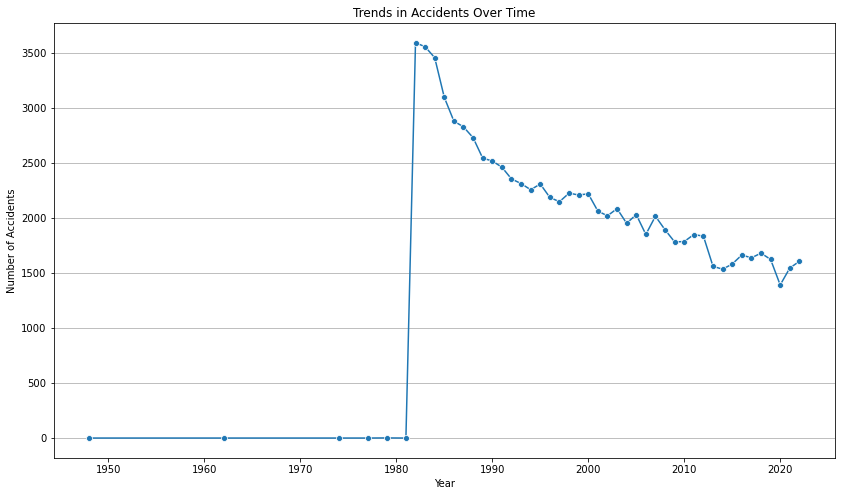
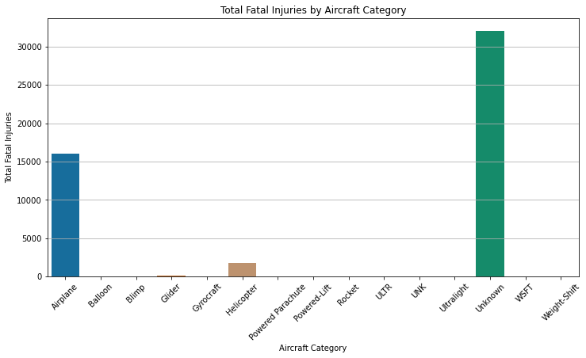
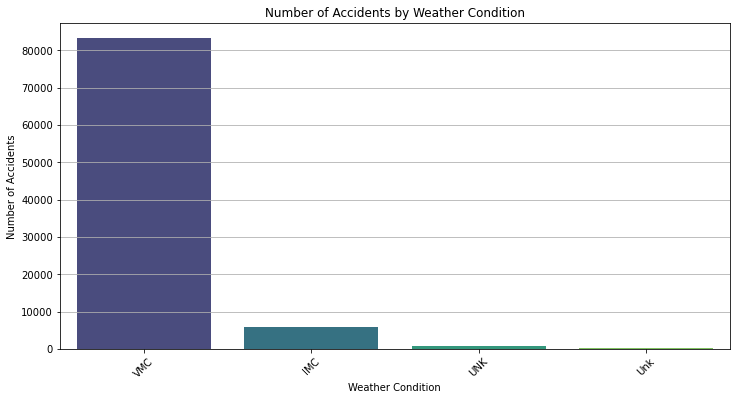

# Overview
This project aims to analyze aviation accident data to identify which aircraft types pose the lowest risk for a company looking to expand into the aviation industry. By leveraging data cleaning, analysis, and visualization techniques, we provide actionable insights to guide decision-making for aircraft purchases.

## Business Understanding
The company is diversifying its portfolio by purchasing and operating airplanes for commercial and private enterprises. The primary business question is: **Which aircraft types are the lowest risk based on historical accident data?**

### Stakeholders
- Head of the Aviation Division
- Business Analysts
- Data Science Team

### Key Business Questions
1. What are the trends in aviation accidents over time?
2. Which aircraft types have the highest and lowest total fatal injuries?
3. How do weather conditions and geographical factors impact accident rates?

# Data Understanding & Analysis

### Source of Data
The dataset is sourced from the National Transportation Safety Board (NTSB), which maintains records of aviation accidents and incidents. It includes aviation accident reports from 1962 to 2023, covering details on accident causes, aircraft types, severity, and locations.

## Description of Data
The dataset consists of over 90,000 records with 31 attributes describing various aspects of aviation accidents.

The dataset contains various fields, including:
- **Event Date**: Date of the accident
- **Aircraft Type**: Type of aircraft involved
- **Total Fatal Injuries**: Number of fatal injuries
- **Total Serious Injuries**: Number of serious injuries
- **Total Minor Injuries**: Number of minor injuries
- **Weather Conditions**: Conditions at the time of the accident
- **Country**: Location of the accident

## Visualizations
1. **Trends in Accidents Over Time**: A line graph showing the number of accidents per year.
   
   
2. **Total Fatal Injuries by Aircraft Type**: A bar chart displaying total fatal injuries for each aircraft type.
   

3. **Accidents by Weather Condition**: A bar chart illustrating the number of accidents based on weather conditions.
   

### Conclusion & Summary
**Key Findings:**
Fatal injuries fluctuate over time, with notable peaks in specific years due to major accidents.
Certain countries experience a higher frequency of accidents, likely due to air traffic and aviation infrastructure.
General aviation aircraft are more prone to accidents, making them riskier for new business investments.

### Summary of Conclusions
1. **Recommendation 1**: Invest in aircraft types with the lowest total fatal injuries.
2. **Recommendation 2**: Consider weather conditions when evaluating aircraft safety records.
3. **Recommendation 3**: Monitor trends in accidents to inform future purchasing decisions.

